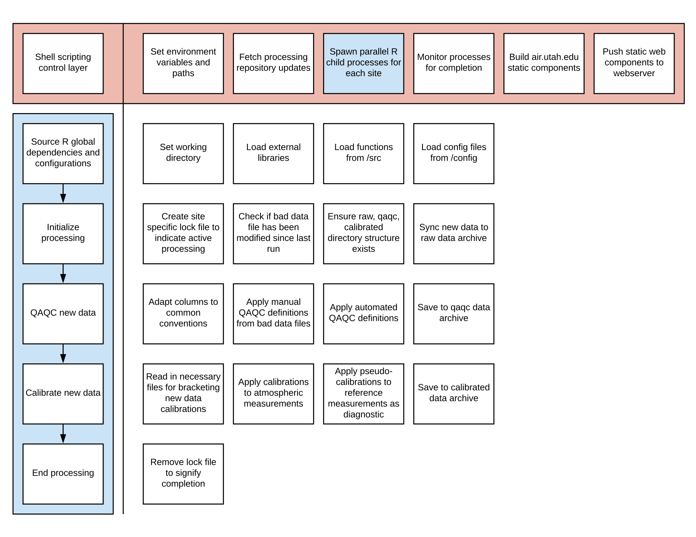

# Repository structure
The trace gas processing tools are broken into five components  
1. `process_data.sh` is the shell scripting control layer called by cron that sets environment variables and executes necessary processing code.  
1. `run/stid.r` called in parallel and executes site-specific processing code.
1. `src/` contains the bulk of processing source code as R functions.  
1. `bad/` contains site/instrument specific bad data files for manual correction or removal of data. Changes are reflected at the qaqc and calibrated data levels.  
1. `config/` contains json configurations for data structure and site metadata.  
1. `.lock/` contains lock files in the form of `site.lock` to indicate active site processing and prevent duplicate execution.  

# Revising historic data
Changes in the historic datasets can be made using the `bad/` data text files. When a new commit is made, the historic record for the given site is reprocessed on the next run (every 5 minutes).

# Site metadata
Site metadata can be found in [config/site_config.csv](config/site_config.csv) and at [air.utah.edu](http://air.utah.edu).  

# Instrument naming conventions
Additional instrument metadata can be found in [config/data_config.json](config/data_config.json).  

Instrument                   | Abbreviation
-----------------------------|----------------------------------
Licor 6262 IRGA              | licor_6262
Los Gatos Research UGGA      | lgr_ugga
MetOne ES642                 | metone_es642

# QAQC flagging conventions
Numeric values are assigned to observations that meet certain automated or human identified criterion. The meaning of these identifiers are as follows.

Flag  | Description
------|-----------------
1     | Measurement data filled from backup data recording source
0     | Data passes all QAQC metrics
-1    | Data manually removed
-2    | System flush
-3    | Invalid valve identifier
-4    | Flow rate or cavity pressure out of range
-5    | Drift between adjacent reference tank measurements out of range
-6    | Time elapsed between reference tank measurements out of range
-7    | Reference tank measurements out of range

